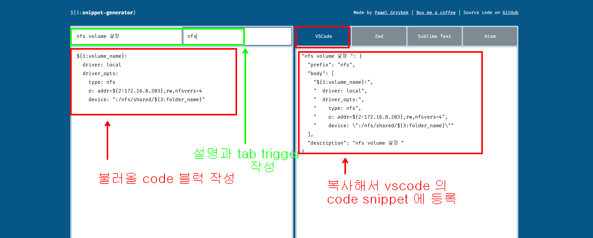
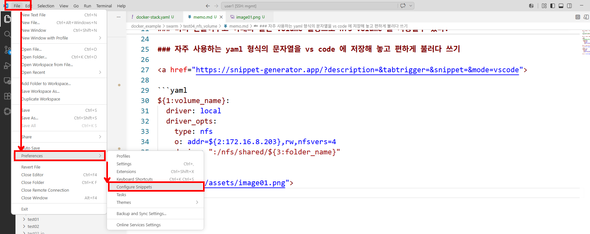
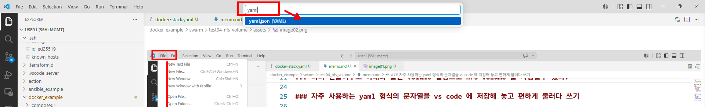
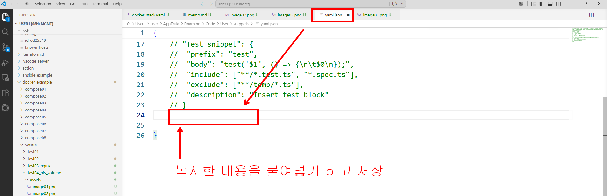

### nfs 서버에 공유 폴더를 만들고 해당 폴더를 postgres 가 volume 으로 사용하도록 설정하기

```bash

# nfs 서버로 가서 아래를 실행해서 공유폴더를 하나 만든다.
./make-nfs.sh  postgres_data

```

### 미리 만들어두고 아래와 같은 volume 설정으로 nfs volume 을 사용할수 있다.

```yaml
volumes:
  # volume 에서 제공해주는 nfs 기능을 이용해서 nfs 연동된 volume 사용하기 
  # 172.16.8.203 nfs 서버에 미리 /nfs/shared/postgres_data 이런경로의 공유 폴더가 만들어져 있어야 된다.
  postgres_data:
    driver: local
    driver_opts:
      type: nfs
      o: addr=172.16.8.203,rw,nfsvers=4
      device: ":/nfs/shared/postgres_data"
```

### 자주 사용하는 yaml 형식의 문자열을 vs code 에 저장해 놓고 편하게 불러다 쓰기

<a href="https://snippet-generator.app/?description=&tabtrigger=&snippet=&mode=vscode">

```yaml
${1:volume_name}:
  driver: local
  driver_opts:
    type: nfs
    o: addr=${2:172.16.8.203},rw,nfsvers=4
    device: ":/nfs/shared/${3:folder_name}"
```





