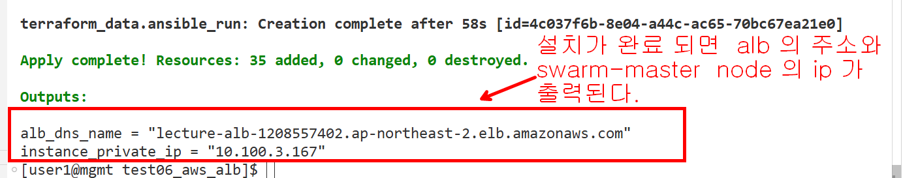
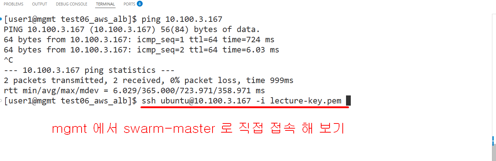
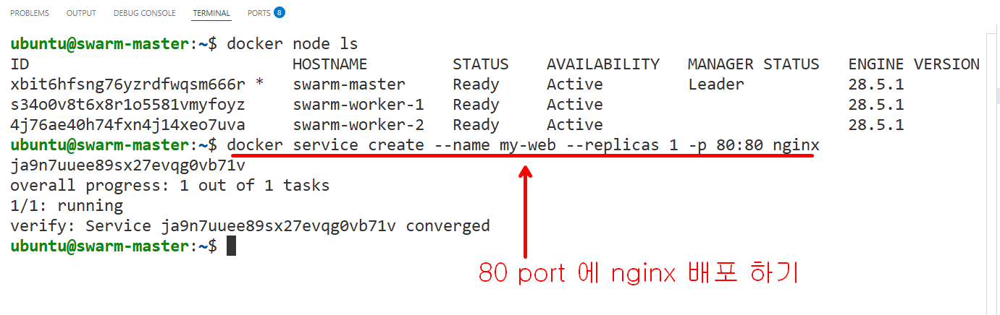
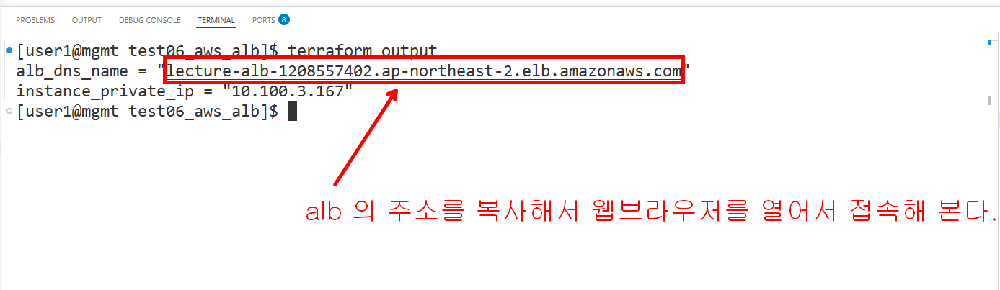
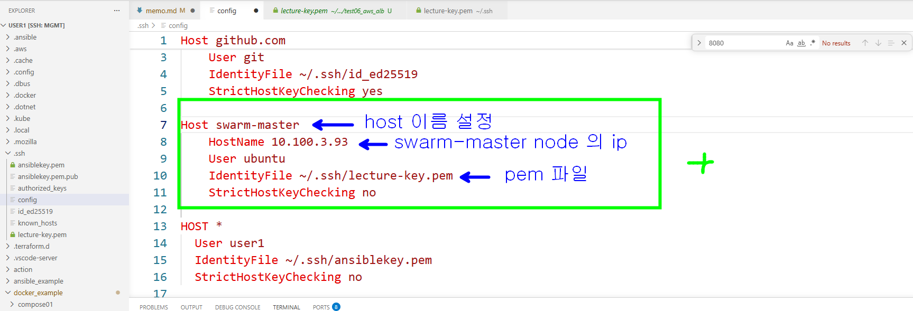
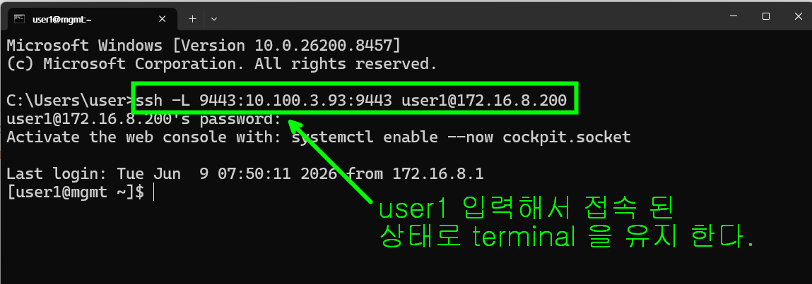

### aws swarm 클러스터 테스트 









### docker context 확인 및 추가

```bash
docker context ls
NAME        DESCRIPTION                               DOCKER ENDPOINT               ERROR
default *   Current DOCKER_HOST based configuration   unix:///var/run/docker.sock 

# 위에 보면 default context 에 * 가 있고 default context 를 사용하는것을 알수 있다. 

```
### aws swarm-master node 의 접속 정보를 ~/.ssh/config 파일에 추가를 해야 한다.


```bash
# context 도 추가한다  ssh://<config 에 추가한 HostName>
# create <context 의 이름은 마음대로 짓기>
docker context create swarm-master --docker "host=ssh://swarm-master"

# 만들어진 context 목록 확인
docker context ls

NAME           DESCRIPTION                               DOCKER ENDPOINT               ERROR
default *      Current DOCKER_HOST based configuration   unix:///var/run/docker.sock   
swarm-master                                             ssh://swarm-master           

# swarm-master context 사용
docker context use swarm-master

# context 확인 
docker context ls

NAME             DESCRIPTION                               DOCKER ENDPOINT               ERROR
default          Current DOCKER_HOST based configuration   unix:///var/run/docker.sock   
swarm-master *                                             ssh://swarm-master            

# aws node 확인
docker node ls

ID                            HOSTNAME         STATUS    AVAILABILITY   MANAGER STATUS   ENGINE VERSION
acp0s1sh5v07m4yt6qxb136pq *   swarm-master     Ready     Active         Leader           28.5.1
50hs1n2hx4tt6a1707e46p4yp     swarm-worker-1   Ready     Active                          28.5.1
vkvijhvr55bjnk38mu83416ig     swarm-worker-2   Ready     Active                          28.5.1

```

### aws 에 portainer 를 실행하고 window 에서 port forward 를 이용해서  접속해 보기

```bash

# window 에서 command 창을 열어서 아래의 정보를 입력한다
# ssh -L 9443:<swarm master 의 ip>:9443 user1@172.16.8.200

# L 은 Local Forwarding -> window 의 9443 port 를 user1@172.16.8.200 을 통해서 10.100.3.93.9443 
# port 로 forwarding 하겠다는 의미 
ssh -L 9443:10.100.3.93:9443 user1@172.16.8.200


# mgmt 의 docker context 를  swarm-master 로 변경하고 potainer stack 을 배포한다
docker context use swarm-master

docker stack deploy -c portainer-agent-stack.yml portainer

# 배포한다음 5분 이내에 window 에서 웹브라우저를 열어서 아래의 주소로 접속해 본다.
https://localhost:9443  

```


```bash

# port forwarding 을 background 로 하기
ssh -N -f -L 9443:10.100.3.93:9443 user1@172.16.8.200
# port forwarding background 프로세스를 찾아서 종료하기
netstat -ano | findstr 9443 
# 위를 실행해서 9443 port 를 사용하는 프로세스 번호를 찾아서 없애기
# taskkill /f /pid 프로세스번호
taskkill /f /pid 25968

```

### 배포한 서비스 제어

```bash
# 우리는 위에서 아래의 서비스를 배포 했다
docker service create --name my-web --replicas 1 -p 80:80 nginx

# 배포한 서비스 목록확인
docker service ls

# 서비스 리플리카 변경
docker service scale my-web=3

# 서비스 삭제
docker service rm my-web

```

### 실습후에 terraform destory 하고 정리 작업하기 

- tailscale api console 에서 swarm-master 삭제
- docker context 를 default 로 변경
- swarm-master docker context 삭제(선택)

```bash

# default context 를 사용하도록 변경 
docker context use default

```